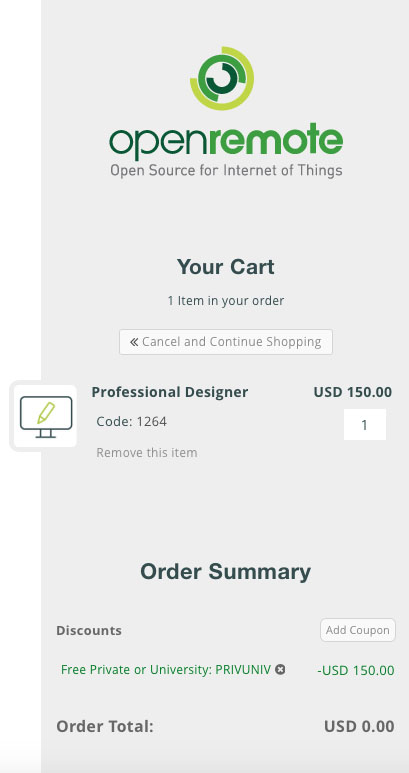

# Chapter 2
## Installation
Getting OpenRemote downloaded, installed, and running should take less than one hour. First we need to register for an OpenRemote account. Open [https://designer.openremote.com/login.jsp](http://designer.openremote.com/login.jsp) and select *Don't have an account?*, then *Order Now*. Fill out the fields for email and address. If you are a private or educational user, or if you want to trial the software as a company, on the right hand side of the window, under *Order Summary*, select *Add Coupon* and enter PRIVUNIV. Then select *APPLY* , which reduces your order total to 0 US$, then select *SUBMIT YOUR ORDER*. 

Figure 2.1 Setting up a free account for OpenRemote Professional Designer

With the user name and password, which you will receive in an email after registration, you login to your new account at [https://designer.openremote.com/login.jsp](https://designer.openremote.com/login.jsp). A window with the OpenRemote Professional Designer GUI will open. Now you can install OpenRemote Controller. Select the *Download Resources* button at the upper right corner of the user interface, and a GitHub window with the latest binary and source code files for OpenRemote Controller will open (Figure 2.2). In the section of the most recent release you go to *Downloads* and select the file OpenRemote_Controller.zip. 
